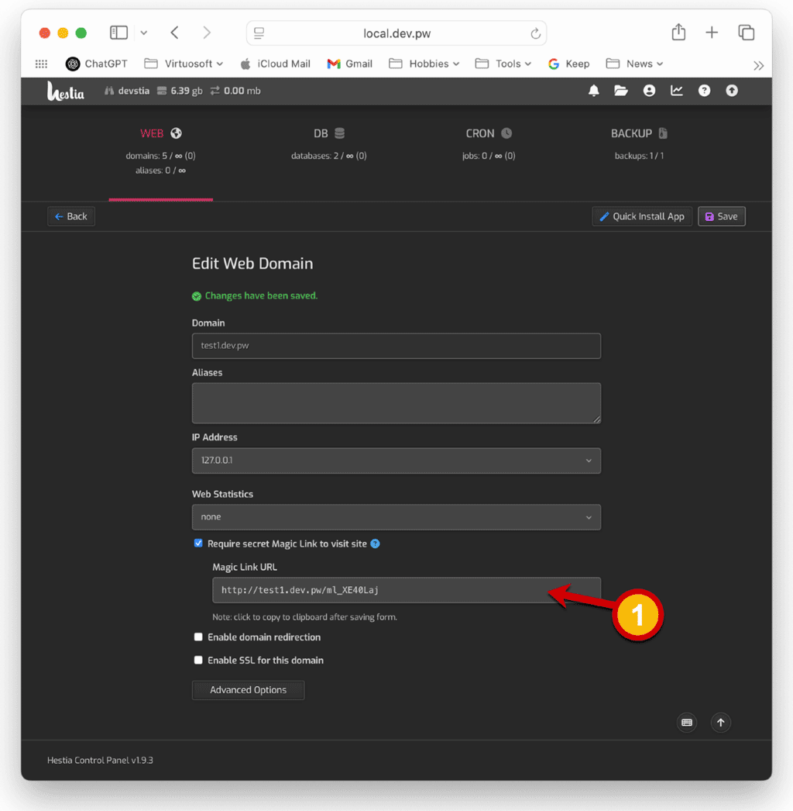

# hcpp-magiclink
A plugin for Hestia Control Panel (via hestiacp-pluginable) that makes an entire website domain inaccessible until a magic link URL is first visited.

## Installation
HCPP-MagicLink requires an Ubuntu or Debian based installation of [Hestia Control Panel](https://hestiacp.com) in addition to an installation of [HestiaCP-Pluginable](https://github.com/virtuosoft-dev/hestiacp-pluginable) (version 2.X or higher) to function; please ensure that you have first installed pluginable on your Hestia Control Panel before proceeding. Clone the latest release version (i.e. replace **v1.0.0** below with the latest release version) to the magiclink folder:


```
cd /usr/local/hestia/plugins
sudo git clone --branch v1.0.0 https://github.com/virtuosoft-dev/hcpp-magiclink magiclink
```

## Using MagicLink to Secure a Website Domain
Magic Link will lock down an entire website domain and prevent any visitors from seeing the website regardless of backend technology (HTML, PHP, or NodeJS). Visitors will only see a page 404 for any URLs under the given domain. Under the `Edit Web Domain` page you will find a new `Require secret Magic Link to visit site` option. Use the checkbox to generate a unique URL that you can send to clients to authorize access to your webiste. With Magic Link turned on, your website domain will become invisible to all users unless they first visit the given URL. Clicking the Magic Link URL will automatically copy the URL to your clipboard (see #1, figure 1 below).

<br><br>
<sub>Figure 1 - Magic Link URL</sub>

The Magic Link plugin will also change the open website icon to use the Magic Link URL on the `Web` listing screen for any sites that have Magic Link turned on. 

> [!NOTE]
> You must save the form to take effect. Magic Link will regenerate a unique URL (invalidating any prior URL) when you turn off and on the `Require secret Magic Link...` checkbox between saves. 

> [!TIP]
> Magic Link supports redirects. You can append a `redirect` GET paramter to the Magic Link URL if you want to redirect to a specific subfolder or page on your website. For example, appending the string `?redirect=/about-us` to the Magic Link URL example from the screenshot:

```
http://test1.dev.pw/ml_XE40Laj?redirect=/about-us
```
This will automatically authorize the user's web browser to view the entire website domain on `test1.dev.pw` and immediately redirect them to the page at:

```
http://test1.dev.pw/about-us
```

## Support the creator
You can help this author's open source development endeavors by donating any amount to Stephen J. Carnam @ Virtuosoft. Your donation, no matter how large or small helps pay for essential time and resources to create MIT and GPL licensed projects that you and the world can benefit from. Click the link below to donate today :)
<div>
         

[<kbd> <br> Donate to this Project <br> </kbd>][KBD]


</div>


<!---------------------------------------------------------------------------->

[KBD]: https://virtuosoft.com/donate

https://virtuosoft.com/donate